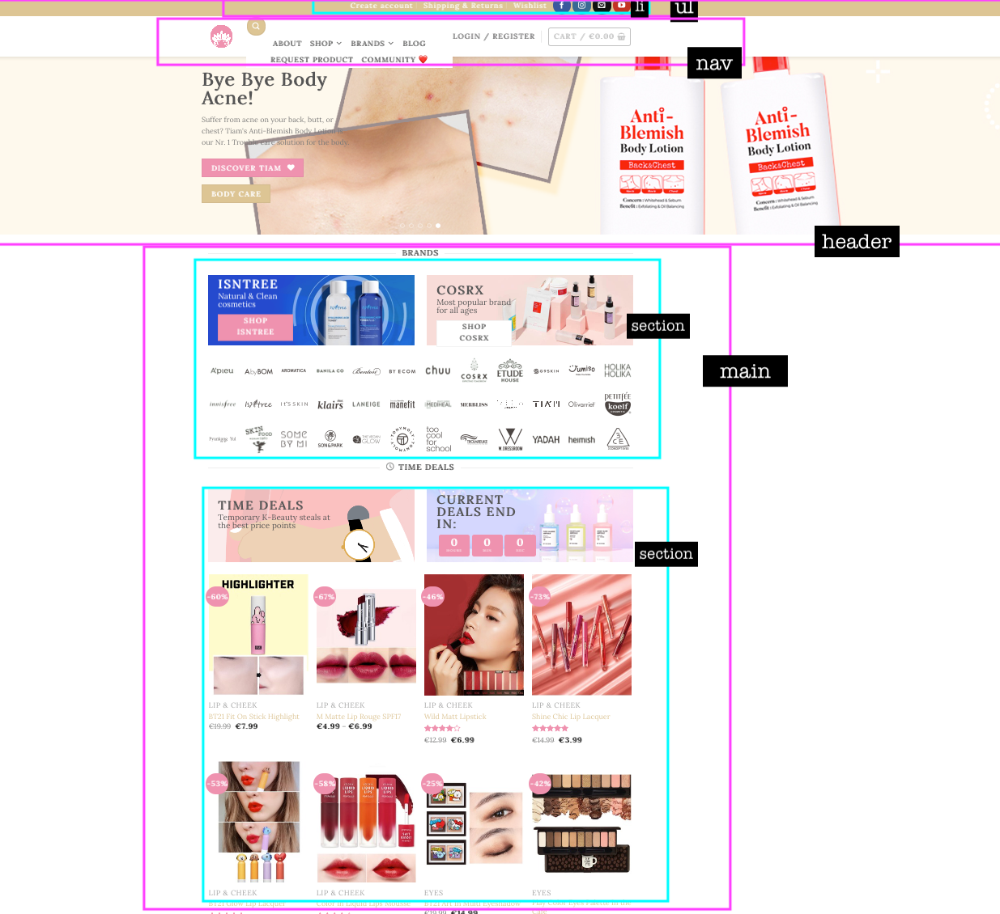
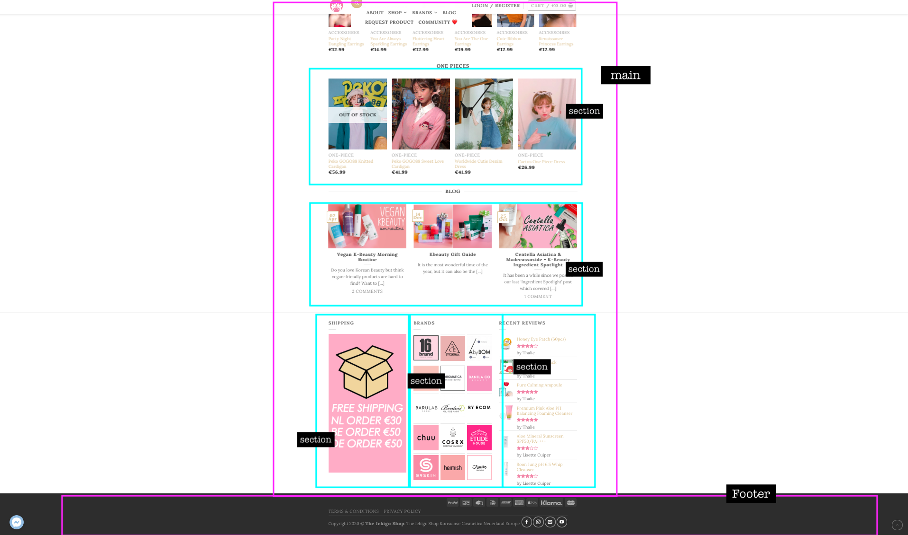

# Procesverslag
**Auteur:** -Soraya Hammaoui-

Markdown cheat cheet: [Hulp bij het schrijven van Markdown](https://github.com/adam-p/markdown-here/wiki/Markdown-Cheatsheet). Nb. de standaardstructuur en de spartaanse opmaak zijn helemaal prima. Het gaat om de inhoud van je procesverslag. Besteedt de tijd voor pracht en praal aan je website.

## Bronnenlijst
1. -bron 1-
2. -bron 2-
3. -...-

## Eindgesprek (week 7/8)

-dit ging goed & dit was lastig-

**Screenshot(s):**

-screenshot(s) van je eindresultaat-

## Voortgang 3 (week 6)

-same as voortgang 1-

## Voortgang 2 (week 5)

-same as voortgang 1-

## Voortgang 1 (week 3)

### Stand van zaken

-dit ging goed & dit was lastig-

**Screenshot(s):**

-screenshot(s) van hoe ver je bent-

### Agenda voor meeting

-samen met je groepje opstellen-

### Verslag van meeting

-na afloop snel uitkomsten vastleggen-

## Intake (week 1)

**Je startniveau:** - Ik twijfel tussen de blauwe en de rode piste.. Zal voor nu voor de Blauwe piste gaan.-

**Je focus:** - Responsive -

**Je opdracht:** -https://shopichigo.com-
-De reden dat ik deze site gekozen heb (buiten het feit dat ik hier te vaak en te veel m'n geld spendeer.) is omdat het mij uitdagend genoeg leek voor mij. Ik vind frontend hartstikke leuk maar bak er niks van. Vorig jaar hebben we veel gewerkt met flexbox en grid en zag dat het ook vaak voor kwam op deze site. Vandaar mijn keuze.
Grootste uitdaging voor mij is het aan het praat krijgen van het grid en de hover actions bij de carrousels.-

**Screenshot(s):**
-De website bevat vele carrousels-

-Dit product staat in een carrousel-

-Als je met je muis over het product hovert, veranderd het plaatje-

-Je kunt het product ook in je wenslijst zetten-

**Breakdown-schets(en):** 

